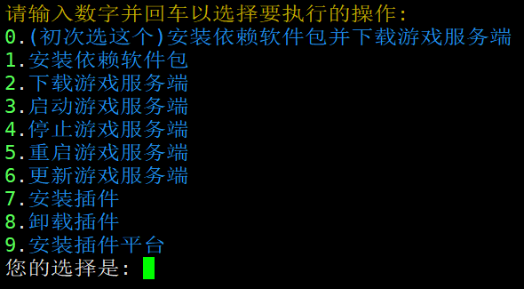

## linux搭服教程（centos/ubuntu/debian版）

#### 一、拥有一个云服务器
1.	- 可去腾讯云、阿里云、华为云、京东云、百度智能云、某淘（关键词：mc vps/云服务器）等
	- 如果去某淘搜"mc vps"记得问商家是否能安装其他游戏服务端使用，是否封海外udp，如果封海外udp则不能搭建求生之路2服务端
2.	服务器配置需求，参考[B站视频：BV1U8411A7UQ](https://www.bilibili.com/video/BV1U8411A7UQ)来购买
	- 补充说明：
	- cpu：	求生之路2服务端是吃单核的，即服务器单核性能越强，则求生之路服务端能设置的人数、特感量、插件量、tick值则越高
	- 内存：	一般来说，求生之路2服务端占用内存在4-6G（一个服，拉满人数和特感的情况下，RPG服务器除外）
	- 带宽：	无固定，参考上面视频说的，但个人建议12人12特100tick以上用10-15m、以下用6-10m（仅限独立带宽，共享带宽自行测试）  
        广告：欢迎加入猫猫云选租面板服及云服：[https://www.nekoidc.com/aff/IOLGXQVP](https://www.nekoidc.com/aff/IOLGXQVP)

#### 二、系统选择
一般来说，云服务器中的linux系统主流是centos、ubuntu、debian三中，但个人建议萌新用ubuntu20系/ubuntu22系，具体因人而异

#### 三、下载开服脚本
1.	用ssh工具，远程到服务器
	- 目前主流工具有：[Xshell 7](https://www.xshell.com/zh/free-for-home-school/)、[Finalshell](https://dl.hostbuf.com/finalshell3/finalshell_windows_x64.exe)(以上点击下载)，均为免费软件（可升级为付费，但一般都是专门用linux系统需要的，如果只开游戏服务端可不用）


2.	下载开服脚本：
	- 2-1.	终端控制台输入（下面命令二选一，右边可以点击复制，下同）：
		```bash
		curl --connect-timeout 10 -m 600 -fSLo "init.sh" "https://gitee.com/cj-mimang/l4d2/raw/master/server_install/linux/init.sh"
		```
		```bash
		wget https://gitee.com/cj-mimang/l4d2/raw/master/server_install/linux/init.sh
		```
	- 2-2.	如果系统无"curl"与"wget"命令，或者下载连接失败或者下载时间过长，可在本网站下载脚本，然后找到文件夹"server_install"下的"init.sh"文件，上传到服务器即可

3.	修改脚本权限
	- 终端控制台输入：
	```bash
	chmod 777 init.sh
	```

4.	启动init.sh文件
	- 终端控制台输入：
	```bash
	./init.sh
	```  
  
	
5.	安装依赖
	- 按步骤4启动脚本后，再按1，安装依赖即可
		- 安装完依赖后会自动安装服务器，如果安装服务器期间安装失败，可以再启动脚本按2，重新安装服务器

6.	修改init.sh文件
	- 6-1.	终端控制台输入：
	```bash
	vim init.sh
	```  
	- 6-2.	寻找参数
		- 寻找以下参数：(一般在脚本最上方，通过上下左右键切换位置，或通过vim程序的命令`/ + 需要寻找的内容，按回车后按n键循环`，例如`/DEFAULT_DIR`)
		- `DEFAULT_DIR="l4d2"`				————文件名（一般不需要修改）
		- `DEFAULT_IP="0.0.0.0"`			————ip地址（此为内网ip，如果不知道则默认就行，建议默认不动）
		- `DEFAULT_PORT="27015"`			————游戏端口
		- `DEFAULT_MAP="c2m1_highway"`		————服务器开始地图
		- `DEFAULT_MODE="coop"`				————服务器游戏模式
		- `DEFAULT_TICK="66"`				————服务器tick值（需要到tick解锁插件或者l4dtoolz扩展插件）
		- `START_PARAMETERS="-strictportbind -nobreakpad -noassert -ip ${DEFAULT_IP} -port ${DEFAULT_PORT} +map ${DEFAULT_MAP} +mp_gamemode ${DEFAULT_MODE} +servercfgfile ${DEFAULT_CFG} -tickrate ${DEFAULT_TICK}"`			—————游戏启动项（原本的不需要做修改，如果想要加其他启动项则在后面加就行，-game 这个启动项不需要加）
		- 根据上面的备注自行修改成自己的数据，修改内容为""里面的内容，=前面的参数不要修改（这些参数一般在第3-10行）
	- 6-3.	修改参数，保存并退出vim：
		- 6-3-1.先按键盘上的"i"键，进入编写模式（即，控制台左下角显示"-- INSERT --"即可）
		- 6-3-2.找到上面所有参数后，根据自己需求修改参数（修改""内的内容即可，其他不用动）
		- 6-3-3.修改完后，按"Esc"键，再输入":wq"保存并退出vim即可
		- 6-3-4.如果你不小心删错东西，或者修改错参数，也是按照上面说的步骤进行，但最后输入的":wq"需要改成":q!"即可不修改并退出vim
		- 6-3-5.如果进入vim提示"Found a swap file by the name ".init.sh.swp" 先按"Q"键退出vim，接着输入
            ```bash
            rm .init.sh.swp
            ```  
            最后再进入vim编辑脚本
            ```bash
            vim init.sh
            ```

7.	再次启动init.sh文件  
  
	- 7-1.终端控制台输入：
	```bash
	./init.sh
	```
	- 7-2.启动脚本后，再按3，启动服务器，即可启动求生之路服务端

8.	init.sh说明：
	- 8-1.	启动完init.sh文件后会有一个菜单，菜单会有不同的选项对应一个数字，如果想运行哪项功能就输入哪个对应数字即可，不可输入多个数字或其他字母/符号等等
	- 8-2.	例如我要启动服务器，则终端控制台输入完"init.sh"后再次输入"3"，即可开启服务器
	- 8-3.	安装服务器选项会删除原本系统中的"steamcmd"文件夹中的原本服务端文件，如果已安装steamcmd.sh（可运行）并且已经安装/上传过服务端文件的话，则运行选项"6"的更新服务器

#### 四、备注说明：
1.	如果运行脚本或者下载脚本期间，遇到"curl: (28) SSL connection timeout"，则再运行一次当前指令即可
2.	如果运行"init.sh"开启服务器，遇到无配置参数，则为没安装服务端文件，再次运行"init.sh"后按"2"安装服务器即可（如果遇到"curl: (28) SSL connection timeout"问题，解决方法同备注1）
3.	此脚本可不需要传输插件平台文件到服务端，因为脚本可以下载安装，用法：
	- 运行"init.sh"后按"9"再按"2"		（如果遇到"curl: (28) SSL connection timeout"问题，解决方法同备注1）
		- 但不建议用"init.sh"脚本来安装插件平台，因为此插件平台为最新版本的插件平台，求生之路2不一定能用，可能会出bug，建议使用[豆瓣酱整合包](https://gitee.com/apples1949/douban-l4d2-plugins-set)中所给的linux版本插件平台  
4.	脚本可通过启动项直接使用相关功能，可通过-h查看帮助信息。详情如下：  
用法: $0 [选项]  
  
主要选项:  
  -0, --install-all      安装依赖软件包并下载游戏服务端  
  -1, --deps-only        仅安装依赖软件包  
  -2, --server-only      仅下载游戏服务端  
  -3, --start            启动游戏服务端  
  -4, --stop             停止游戏服务端  
  -5, --restart          重启游戏服务端  
  -6, --update           更新游戏服务端  
  -9, --install-platform 安装插件平台  
  
等待控制参数:  
  --skip-script, -ws [true/false]  控制依赖安装等待  
  --skip-package, -wp [true/false]  控制快速更新包等待  
  --skip-delete, -wd [true/false]  控制删除服务端目录等待  
  --skip-updata, -su <Steam账户> <Steam密码>  自动使用Steam账户登录Steamcmd  
  
等待行为说明:  
  true:  跳过等待，直接执行后续操作  
  false: 不等待，直接跳过后续操作  
  不传或异常: 保持原行为 (等待3秒，按键跳过，否则执行)  
  需要将等待控制参数写在主要选项前 否则不生效  
  
示例:  
	```bash
	./init.sh --skip-script true --skip-package false --install-all  
	```  
	可直接安装依赖软件包并下载游戏服务端且安装使用换源脚本和跳过使用Steamcmd快速更新包
	```bash
	./init.sh -ws true -wp false -wd true -2  
	```  
	可直接下载游戏服务端并下载游戏服务端且不安装使用换源脚本和使用Steamcmd快速更新包
  